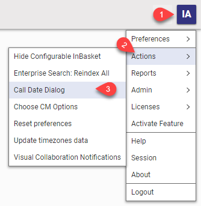

# Call Date Dialog

This project contains sample code that demonstrates how to call a datepicker dialog from method code.

## Project Details

#### History:

Release | Notes
--------|--------
[v1.0.2](https://github.com/ArasLabs/call-date-dialog/releases/tag/v1.0.2) | Updated Usage for v12 
[v1.0.1](https://github.com/ArasLabs/call-date-dialog/releases/tag/v1.0.1) | Tested 11.0 SP12, SP15. Tested on Edge, Firefox 60 ESR, Chrome.
[v1.0.0](https://github.com/ArasLabs/call-date-dialog/releases/tag/v1.0.0) | First release. Tested on Internet Explorer 11, Firefox 38 ESR, Chrome.

#### Supported Aras Versions:

Project | Aras
--------|------
[v1.0.2](https://github.com/ArasLabs/call-date-dialog/releases/tag/v1.0.2) | 11.0+, 12.0+ 
[v1.0.1](https://github.com/ArasLabs/call-date-dialog/releases/tag/v1.0.1) | 11.0 SP7+, 11.0 SP12+, 11.0 SP15
[v1.0.0](https://github.com/ArasLabs/call-date-dialog/releases/tag/v1.0.0) | 11.0 SP7

## How It Works

The project's import package contains a Javascript method - labs_CallDateDialog. This method calls a datepicker dialog and then executes a custom callback function with the selected date as a parameter. The callback function in this sample code simply displays the date parameter in a browser alert, but the same approach could be used to perform some other business logic with the selected date.  

## Installation

#### Important!

**Always back up your code tree and database before applying an import package or code tree patch!**

### Pre-requisites

1. Aras Innovator installed (see "Supported Aras Versions" above)
2. Aras Package Import tool
3. CallDateDialog import package

### Install Steps

1. Backup your database and store the BAK file in a safe place.
2. Open up the Aras Package Import tool.
3. Enter your login credentials and click **Login**.
   * _Note: You must login as root for the package import to succeed!_
4. Enter the package name in the TargetRelease field.
   * Optional: Enter a description in the Description field.
5. Enter the path to your local `..\CallDateDialog\Import\imports.mf` file in the Manifest File field.
6. Select **CallDateDialog** in the Available for Import field.
7. Select Type = **Merge** and Mode = **Thorough Mode**.
8. Click **Import** in the top left corner.
9. Close the Aras Package Import tool.

You are now ready to login to Aras and try out the Call Date Dialog action.

## Usage

1. Log in to Aras as admin.
2. From the User menu (upper right corner), select **Actions > Call Date Dialog**.
   - In v11, use the **Actions** menu to choose the **Call Date Dialog** Action.
3. When the datepicker dialog appears, choose a date.

The dialog will be dismissed and a browser alert dialog will appear, displaying the selected date value.

## Contributing

1. Fork it!
2. Create your feature branch: `git checkout -b my-new-feature`.
3. Commit your changes: `git commit -am 'Add some feature'`.
4. Push to the branch: `git push origin my-new-feature`.
5. Submit a pull request.

For more information on contributing to this project, another Aras Labs project, or any Aras Community project, shoot us an email at araslabs@aras.com.

## Credits

Original method code written by Rob McAveney for Aras Labs. @rmcaveney

Documented and published by Eli Donahue for Aras Labs. @EliJDonahue

## License

Aras Labs projects are published to Github under the MIT license. See the [LICENSE file](./LICENSE.md) for license rights and limitations.
